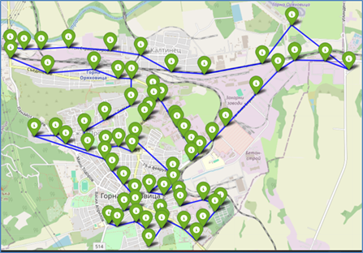
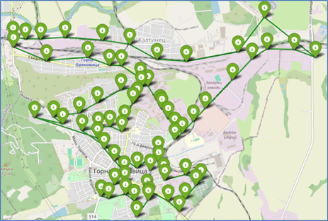
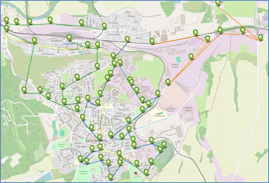
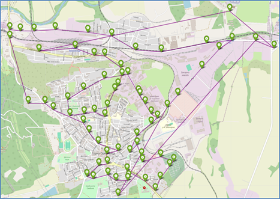
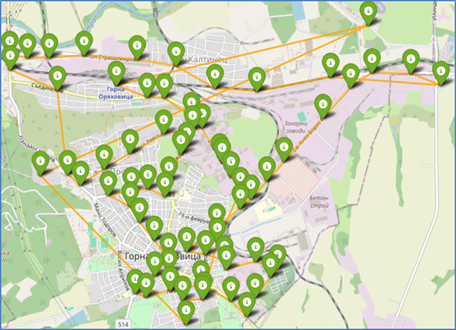

# 🐜 AntColony-Bus-Optimizer
**Optimization of public transport routes in Gorna Oryahovitsa using Ant Colony Optimization (ACO) and Greedy TSP algorithms. Includes clustering, distance/time matrix generation, and interactive maps.**

## 📚 Library Imports
The project uses the following libraries:

- `pandas`, `numpy` – for structured data manipulation
- `random`, `time`, `math` – for stochastic operations and timing
- `os` – file path handling
- `folium` – interactive maps with stop markers, tooltips, popups and polylines
- `openrouteservice` – API integration to compute distances and durations between stops
- `sklearn.cluster.KMeans`, `silhouette_score` – clustering stops using coordinates
- `matplotlib.pyplot` – for color management and visualization

All packages must be installed beforehand via `pip install -r requirements.txt`

## 🔑 API Key and Stop Visualization

### 🔹 Loading OpenRouteService API Key

The script reads a private API key for [OpenRouteService](https://openrouteservice.org/) from a local `.txt` file:

```python
with open("Basic Key.txt", "r") as f:
    api_key = f.read().strip()
```

This key is required if you want to generate new distance or duration matrices based on real driving data.

### 📥 Loading Bus Stop Data

The stop information is stored in an Excel file:
- **Filename**: `stops_gorna_oryahovitsa_final.xlsx`
- **Columns**:
  - `Спирка №` – stop number (e.g., "СП 23")
  - `Име на спирка` – stop name (e.g., "Център 1", "ЖП гара")
  - `Latitude, Longitude` – coordinates as string, later split into numeric values
  - `Достъпност` – accessibility flag ("Да" / "Не")

### 🗺️ Interactive Map with All Stops

Using the **Folium** library, the script creates an interactive HTML map of all bus stops:

- ✅ Green markers for accessible stops
- ❌ Red markers for non-accessible stops
- Hover tooltips and click popups display stop number, name, and accessibility
- The map is centered based on the average of all coordinates

📤 Output file: `all_stops_map.html`

## 📏 Distance Matrix (meters)

This block handles the creation or loading of a **distance matrix** between all bus stops in meters.

### ⚙️ Modes:
- If `generate_new_matrix = True`, the script queries the OpenRouteService API to compute **road distance** between each stop pair and saves the result in `distance_matrix_part1.xlsx`.
- By default, it loads an existing matrix from this file.

### 📄 Matrix Properties:
- Shape: `N × N` square matrix (e.g., 47 × 47)
- Source: OpenRouteService (`profile='driving-car'`)
- Units: meters
- Diagonal: 0 (distance to self)
- Symmetric: ✔️ Yes (`d[i][j] ≈ d[j][i]`)
- File output: `distance_matrix_part1.xlsx`

📥 The matrix is stored as a `pandas.DataFrame` called `distance_df` and used in later steps by the ACO and Greedy algorithms.

## ⏱️ Duration Matrix (seconds)

This block handles the creation or loading of a **duration matrix** between all stops, measured in travel time (seconds).

### ⚙️ Modes:
- If `generate_new_duration_matrix = True`, the script calls OpenRouteService API with `metrics=['duration']`.
- Due to API request limits, it splits the job into batches (default: 35 stops per batch).
- Each batch is saved in a separate file in `duration_batches/`.
- After batch generation, the files can be manually merged into `time_matrix_part1.xlsx`.

### 📄 Matrix Properties:
- Shape: `N × N` (e.g., 47 × 47)
- Units: seconds
- Asymmetry: partially asymmetric due to traffic (i.e., `duration[i][j] ≠ duration[j][i]`)
- Diagonal: 0 (time to self)
- File output: `time_matrix_part1.xlsx`

📥 The matrix is loaded into a `pandas.DataFrame` called `duration_df`, used later in ACO and Greedy calculations.

## 🧩 Stop Clustering with KMeans

To improve route management, the script applies **KMeans clustering** to group stops geographically before optimization.

### ⚙️ Method:
- Input: latitude and longitude coordinates of all stops
- Algorithm: `sklearn.cluster.KMeans`
- Range: tries `k` from 3 to 10
- Evaluation metric: **Silhouette Score** to select the optimal number of clusters

### 📌 Output:
- Best number of clusters: `optimal_k`
- A new column `cluster` is added to the stops DataFrame (`df_all`), with values `0, 1, ..., k-1`
- Clusters are used later for **local route optimization** with ACO

🧠 This step performs **unsupervised learning** to logically group nearby stops and reduce route complexity.

## 🐜 Ant Colony Optimization (ACO)

This block implements the **Ant Colony Optimization (ACO)** algorithm to solve the Traveling Salesman Problem (TSP) across the bus stops.

### 🎯 Goal:
- Find the shortest or fastest possible route visiting all stops exactly once

### 📥 Inputs:
- `distance_df` – distance matrix (in meters)
- `duration_df` – time matrix (in seconds)

### 🔧 Parameters:
- `alpha` – influence of pheromone trails
- `beta` – influence of distance heuristic
- `evaporation` – pheromone evaporation rate
- `Q` – pheromone deposit amount
- `num_ants` – number of ants per iteration
- `num_iterations` – number of optimization cycles

### 🔄 Process:
- Full grid search over combinations of ACO parameters
- Each ant simulates a tour based on pheromone and distance probabilities
- Best tour (by distance and time) is recorded
- Final best solution is chosen globally by performance score

### 📤 Outputs:
- `best_named_distance` – optimal path by **distance**
- `best_named_duration` – optimal path by **time**
- `best_score_distance`, `best_score_duration` – total metrics
- `best_params_*` – parameter set that achieved the best result

## 🗺️ Visualizing ACO Routes with Folium

After finding optimal routes via ACO, the project generates **interactive HTML maps** using the `folium` library.

### 🧭 Function: `visualize_route(...)`

#### 📥 Inputs:
- `best_named_list` – ordered list of stop names for the route
- `df_all` – DataFrame with all stop info (coordinates, accessibility)
- `color` – color for the path line
- `output_path` – filename for the HTML map

### 🖼️ Map Features:
- Blue numbered markers for each stop in the route
- Red/green markers for all stops based on accessibility
- Connecting line (PolyLine) between stops
- Tooltip on hover and popup on click
- Centered automatically using route coordinates

### 📤 Output files:
- `aco_distance_map.html` – optimized by distance (blue line)
- `aco_duration_map.html` – optimized by time (green line)

### 🖼️ ACO Route – by Distance:


### 🖼️ ACO Route – by Duration:


---

## 🧭 ACO per Cluster (Local Optimization)

Instead of one global route, this block applies **ACO separately within each KMeans cluster** to generate localized routes.

### 🧬 Process:
1. For each cluster:
   - Filter stops belonging to that group
   - Extract submatrices for distance and time
   - Run ACO optimization locally
2. Visualize each cluster’s route in a different color using `tab10` colormap

### 📥 Inputs:
- Clustered stops (`df_all` with `cluster` column)
- `distance_df`, `duration_df`
- Coordinates and accessibility

### 📤 Output files:
- `combined_routes_distance.html` – per-cluster shortest routes (color-coded)
- `combined_routes_duration.html` – per-cluster fastest routes (color-coded)

### 🖼️ Clustered Route – by Distance:


### 🖼️ Clustered Route – by Duration:


🗺️ These maps help visualize how buses could operate in parallel zones of the city, optimizing routes **locally**.


## ⚡ Greedy TSP Route Optimization

This block implements a **Greedy heuristic algorithm** for solving the TSP – selecting the nearest unvisited stop at each step.

### 🎯 Goal:
- Quickly compute an approximate route with minimal logic

### 📥 Inputs:
- `distance_df` – distance matrix (in meters)
- `duration_df` – duration matrix (in seconds)

### 🔄 Process:
- Start from a random stop
- At each step, visit the nearest unvisited stop
- Stop when all stops have been visited

### ⏱️ Execution Time:
- Extremely fast (< 0.01 seconds on most machines)

### 📤 Output files:
- `greedy_distance_map.html` – route by distance (purple line)
- `greedy_duration_map.html` – route by time (orange line)

🖼️ Greedy Route – by Distance:


🖼️ Greedy Route – by Duration:
  

⚠️ Note: The Greedy solution is quick, but often suboptimal – routes are longer and less structured compared to ACO.

## 📊 ACO vs. Greedy Comparison

This chart summarizes the performance difference between the two algorithms.

📂 [Download Excel file: ACO_vs_Greedy_TSP_Comparison.xlsx](./ACO_vs_Greedy_TSP_Comparison.xlsx)

